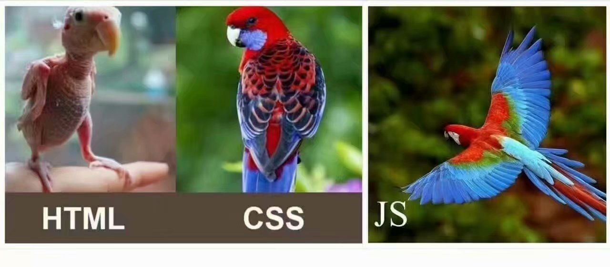
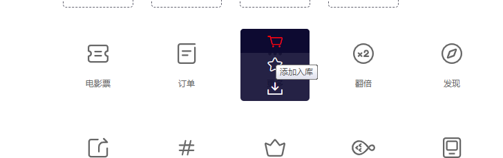
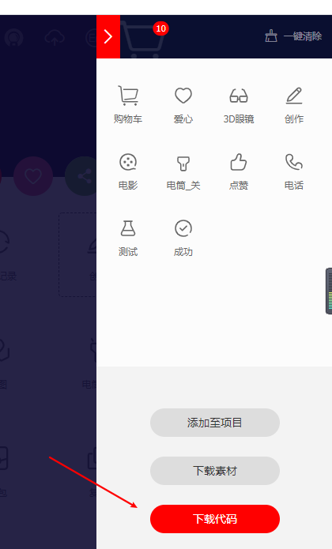

k'bo

隔壁老徐:

   13301605635

#### 关于浏览器:

   IE  360 uc   QQ 谷歌 2345 火狐 搜狗....

查看不同浏览器的内核:

### <http://mybrowse.osfipin.com/>

#### 5大浏览器内核厂商

IE                          Trident 三叉戟 内核

firefox                  Gecko  壁虎     内核

chrome                 Blink  （基于webkit）

safari                     Webkit                 

opera                  Presto内核  放弃治疗了  跟着chrome走了。

 不同的浏览器内核在解析html/css/js的过程中显示的效果是不一样的。

#### web标准化(统一标准)->w3c万维网组织

#### 网页的划分

1.结构: 理解为 毛坯              html

2.表现:  样式的体现  装修    css

3.行为:  动起来 跳起来          javascript 



#### HTML概述(Hyper Text Markup language) 

​    1、全称:超文本标记语言

​    2、是一门标记语言/标签

   3、历史

​        html1-93年

​        html2 -95年

​        html3-96年

​        html4: 97年    

​         html4.1 html4.2

​         html 5 2008最早提示到2014定标

####      基本结构

```html
<!DOCTYPE html>            文档的定义
<html lang="en">           包裹所有的内容  
<head>                         头 
    <meta charset="UTF-8">    编码格式是utf-8  默认服务器是不支持中文的需要改为utf-8支持了 
    <title>Title</title>      标题
</head>
<body>                      主体内容:网页的所有显示的内容都在这里体现
  <p>w shi</p>              
</body>
</html>                 结束标签 
```

####      基本的语法:

​       <包裹标签>  如果是双标签得有结束标签

​       <></>            /就叫做结束符号

#####       划分:

​	   1.单标记/标签  可以省略结束符 /

​                 <>

​	   2.双标记/标签    不能省略 

​                <><>

#####       元素:=标签+内容

         <title>隔壁老徐到此一游</title> 

#####     默认特点简单的标签: 

​    （精装房自带的装修）

```css
   h1-h6                :标题 又大又粗    独占一行
   p                    :包裹文本 上下有间距               独占一行
                         下面的都是   共享一行
   i        斜体
   u        下划线   
   s 		删除线
   b		加粗
   pre      编辑的空格和换行会解析出来
   sup       上标        立方 平方显示
   sub       下标        化学方程式
```

​     注意事项:  默认编辑代码的时候 多个空格/换行 浏览器解析 只会解析为一个空格

#####    转义字符 ：

```html
  &lt;   <
  &gt;    >
  &copy;  ©  
  &nbsp;  空格
   ....  不需要记
```

####    自带的属性

​    定义:  修饰元素的。

​        1.id            用于标记唯一的编号   习惯在js中使用

​	2.title       鼠标悬停的文档说明

​	3.class     css中选择器的类名

​	4.style     内联样式  : 修饰元素的 字体 背景 宽高 、、、、

####    分类

​       独占一行块元素 可以随意的修改宽高:   

​          h1-h6   p     div

​       共享一行的行内元素 默认情况是不能改宽高的:

​          i u s  sub sup  b   small   span     a

​          img 是特殊的行内元素(可以设置宽高)

   注意:只有块级元素中的文本 默认情况下 可以使用align属性让文本居中。行内元素则不行。

#### 图像的标签

  img

属性:

​    src: 引入 图像的地址

​    alt:  图像没有引入成功的文本

​     width:宽度

​     height:高度

​     注意: 如果图像只改变一个值 那么图像的大小呈现的是 等比缩放。

​               在html中在属性中 数值可以不用加单位 默认就是px像素

```html
<!--     图像的路径  图像没有引入成功显示的文本-->
<!--  绝对路径 :从根路径下开始的全部的完整路径  了解即可 千万不要使用-->
<!---->
<!-- 相对路径-->
<!--1 我和我媳妇在一个小房间-->
<h1>同一个目录下 只需要直接引入图像的名称即可</h1>

<h2>图像在子文件夹中  需要先进入子文件夹 关门 再引入图像的名称</h2>

<h3>网页在子文件夹中  需要返回上一层的目录 关门 再引入图像的名称 ../</h3>


<!-- 宽高 只给一个值的话  那么图像会等比缩放-->

```

####    超链接 

​       语法:  

```
 <a>文本</a>
```

​         属性:

​           1.href    值是网页的地址  必须全称+http://www.xxx

```html
<!--默认的   在当前标签页打开网页-->
<a href="http://www.baidu.com" target="_self">度娘1</a>

<!--默认的   在新的标签页打开网页-->
<a href="http://www.baidu.com" target="_blank">度娘2</a>
```

​          功能:

​		1.作为页面的跳转    

​                       src需要加完全的路径:http://www.xxx

​        2.实现下载

​        3.返回页面顶部： <a href="#">返回页面顶部</a>

​		4.执行js脚本

```html
<!--默认-->
<a href="http://www.baidu.com">度娘</a>
<!--默认的   在当前标签页打开网页-->
<a href="http://www.baidu.com" target="_self">度娘1</a>

<!--默认的   在新的标签页打开网页-->
<a href="http://www.baidu.com" target="_blank">度娘2</a>

<!--下载-->
<a href="黑人.zip">你懂得</a>

<!-- 执行 js的语法-->
<a href="javascript:alert('还可以')">隔壁老徐颜值咋样</a>
<!--为了 撑起页面的高度-->
<div style="height:2000px;"></div>
<!-- 返回页面的顶部-->
<a href="#">返回页面顶部</a>
```

​      5.锚点: 

​         步骤1: 定义一个锚点  /做标记

```
 可以是a的name属性
 可以是任意标签的 id属性的值
```

​       步骤2 :跳转 

```
href="#后面跟锚点的名称  也就是上面定义锚点的id/name属性的值"
```

```html
 <!--1做记号
      可以是a的name属性
      可以是任意标签的 id属性的值
     -->
    <a href="" name="red">红</a>
   <div id="yellow" style="height: 1000px;background-color: #f3ac32"></div>
   <div id="black" style="height: 1000px;background-color: #0e0903"></div>
   <div id="green" style="height: 1000px;background-color: #30f314"></div>
   <div id="blue" style="height: 1000px;background-color: #3825f3"></div>


<!--2跳转   #后面跟锚点的名称-->
   <a href="#red">红</a>
   <a href="#yellow">黄</a>
   <a href="#black">黑</a>
   <a href="#green">绿</a>
   <a href="#blue">蓝</a>
   <!--跳转到不同网页的 锚点的跳转  -->
   <a href="04_图像的引入.html#xf">媳妇</a>
   <div  style="height: 1000px;background-color: #e5f377"></div>
```

#### 表格

   默认情况下:  垂直方向居中

  table    表格 

​        tr   行

​       td   列

table的属性:

​     border: 边框

​    width: 表格的宽度

​    height:表格的高度

​    bgcolor:表格的背景颜色

​    align:  left  center  right   水平排列方式  默认是靠左  居中  靠右

​    cellspacing:   边框和边框之间的距离 叫做外边距 

​    cellpadding:  边框和内容之间的距离   叫做内边距

  tr:行

​      align     水平排列

​      bgcolor   背景

​        valign:   垂直排列 top  middle  bottom  上中下

 td:列

   rowspan   跨行合并    行和行之间的合并

   colspan     跨列合并

**注意:  跨的行/列值从自己开始数。别忘了 垮了n行/列 删除n-1个单元格**

```html
<h1 align="center">表格</h1>
<!--   注释: 不会被浏览器解析 程序员自己看的代码
table>tr*3>td*4  快捷写法  
-->
<table border="1" width="800" height="200" align="center" bgcolor="aqua"
       cellspacing="0" cellpadding="0">
    <tr align="center" bgcolor="#ff4500">
        <td>编号</td>
        <td>单价</td>
        <td>数量</td>
        <td>总价</td>
    </tr>
    <tr>
        <td>01</td>
        <td>998</td>
        <td>1</td>
        <td>998</td>
    </tr>
    <!--设置 垂直的排列-->
    <tr valign="bottom">
        <td bgcolor="#ffe4c4" colspan="4">总计:</td>
        <!--<td></td>-->
        <!--<td></td>-->
        <!--<td></td>-->
    </tr>
</table>
<h1>表格的规范</h1>
<table border="1" width="800" height="400" align="center" bgcolor="aqua"
       cellspacing="0" cellpadding="0">
    <caption>表格的标题</caption>
    <!--表头   加粗  默认水平垂直居中-->
    <thead >
       <tr height="100">
           <th>1</th>
           <th>3</th>
           <th>4</th>
           <th>2</th>
       </tr>
    </thead>
    <tbody>
    <tr>
        <!--跨列操作  记得删除1个单元格-->
        <td colspan="2">11</td>
        <!--<td>22</td>-->
        <td>33</td>
        <td>44</td>
    </tr>
    <tr>
        <td>111</td>
        <td>111</td>
        <td>111</td>
        <!--跨行操作-->
        <td rowspan="2">111</td>
    </tr>
    <tr>
        <td>555</td>
        <td>666</td>
        <td>777</td>
        <!--<td>888</td>-->
    </tr>
    </tbody>
</table>
```

### day02

####  1.网页头部的小图标

```html
 和什么类型的图片没有关系    需要改的是  rel的值="icon"
<!--<link rel="icon" href="img/jd.ico">-->

    <link rel="icon" href="img/tmall.png">
```

#### 2.列表

   1.有序列表

​        ol>li

   2.**无序列表**     使用这个比较多   一般都是不要前面的标签

​     

​       ul>li

```html
<!--type: a A 1 I i 很少用-->
<ol type="I">
    <li>孙悟空</li>
    <li>弼马温</li>
    <li>齐天大圣</li>
    <li>美猴王</li>
    <li>大师兄
      <!--支持嵌套的  无序列表举例 disc 实心圆....  none主要的操作 不设置前面的标记-->
        <ul type="none">
            <li>唐三藏</li>
            <li>猪八戒</li>
            <li>沙和尚</li>
            <li>白龙马</li>
        </ul>
    </li>
</ol>
```

| **值**      | **说明**             | **语法示例**                        |
| ----------- | -------------------- | ----------------------------------- |
| **none**    | **无标记符号**       | **list-style-****type:none****;**   |
| **disc**    | **实心圆，默认类型** | **list-style-****type:disc****;**   |
| **circle**  | **空心圆**           | **list-style-****type:circle****;** |
| **square**  | **实心正方形**       | **list-style-****type:square****;** |
| **decimal** | **数字**             | **list-style-****type:decimal**     |


#### 3.语义化标签

   增强代码的可读性

```html
  <header>头部信息</header>  ==  <div id=header></div>
  <nav>侧边</nav>
  <section>主体内容</section>
  <footer>页面的尾部</footer>

```

#### 4.iframe标签

​    引入其他页面:  代码重用

```html
<!-- 默认情况下  引入iframe的宽高是 300*150px   可以更改宽高 -->
<iframe src="07_header.html" frameborder="0" width="100%" height="85px"></iframe>
```

#### 5.表单(重要)

  面向用户的产品中的一个必备的模块；用来和用户打交道的。

 语法: 

```
<form>
    n个表单的控件(子元素)
 </form> 
```

  form属性:     

​       1.action:  表单跳转的服务器的地址 

 			默认不写是跳转到当前页面

​       2.method: 跳转的方式 

​                get:  一般是从服务器端获取数据

​                       明文提交会在地址栏显示提交的内容 包括密码 隐私性安全性交叉较差

​                       提交的数据的大小是受限制  kb级别

​                post:一般是向服务器发送数据

​                        隐式提交  在地址栏看不到提交的内容

 			           传输没有数据大小限制

   表单的一些常见控件(子元素)          

#####     1.input:

​           属性:  

​          type: 不同的值  决定这控件的功能是不同的

​          name:   作为服务器端识别的 标志    必须加

​          value:值    用户给的值固定的值

​         placeholder="请输入用户名"   智能提示的属性

​         maxlength:  输入最大的长度限制

​         readonly: 只读  不能修改内容   但是 数据会提交给服务器

​         disabled: 禁用    不能修改内容    也不会提交给服务器

  type:属性

​       text:普通文本

​      password:密文

​      radio:单选

​     checkbox:多选 

​            checked属性  默认勾选

   submit:提交

   reset:重置

  button:普通按钮 一般用来结合js用的

  hidden:隐藏的控件    用户看不到 但是可以提交给服务器

  file     上传文件

```html
<form action="">
    <!--    text:普通的文本-->
    <p>用户姓名: <input type="text" name="uname" value="隔壁老徐" placeholder="请输入用户名" minlength="3"
     disabled></p>
    <!--password:密文-->
    <p>用户密码: <input type="password" name="pwd" value="" placeholder="请输入密码" maxlength="6"></p>
     <!--radio 一组单选或者多选 name值必须一致-->
    <p>
        用户性别: <input type="radio" name="rdo">男
                  <input type="radio" name="rdo">女
                  <input type="radio" name="rdo">其他
    </p>
    <p>
        用户爱好:
        <input type="checkbox" name="chk">吃
        <input type="checkbox" name="chk">喝
        <input type="checkbox" name="chk">玩
        <input type="checkbox" name="chk">乐
    </p>
      <!--提交-->
    <input type="submit">
    <!--重置-->
    <input type="reset">
    <!--普通按钮 没有任何的功能       实现了 点击自增-->
    <input type="button" value="0" onclick="this.value++">
</form>
```

  label标签: 链接控件和文本作用让点击文本如同点击控件效果

  语法使用  

1.通过  id属性  在label中的for引入

 2.直接用label包裹

```html
       <input type="radio" name="rdo" id="nan">
       <label for="nan">男</label>

<label>用户密码: <input type="password" name="pwd" value="" placeholder="请输入密码" maxlength="6"></label>
```

```js
encodeURI('我喜欢你')：编码  ->%E6%88%91%E5%96%9C%E6%AC%A2%E4%BD%A0
decodeURI("%E6%88%91%E5%96%9C%E6%AC%A2%E4%BD%A0")  ->我喜欢你
```

​    **下拉选择框:**

```html
<select name="sel" id="">
    <option value="0">北京</option>
    <option value="1">上海</option>
    <option value="2">深圳</option>
    <option value="3">广东</option>
    <option value="4">南昌</option>
</select>
```

​    文本域:

```
自我介绍: <textarea  name="tarea" id="tt" cols="30" rows="10">
                输入多行文本
        </textarea>
```

#### html写样式的弊端

```html
<!--代码的重用性 可维护性差 -->
<div style="color:red">寒江孤影</div>
<div style="color:red">江湖故人</div>
<div style="color:red">相逢何必曾相识</div>
```

#### css:(Cascading Style Sheets)层叠样式表

解决html写样式的弊端

 实现了内容和样式的分离  

语法: 

​	1.可以继续写在元素中

​	2.写在head表头中

```css
 <style>
        选择器{
            属性:值;
            属性2:值2;
            ...
        }
    </style>
```

​	3.可以单独新建一个.css文件 通过link引入

```html
    <!-- 遵守相对路径的原则-->
    <link rel="stylesheet" href="10.css">
```

特征:

 1.优先级的问题

​         ！important  最高级别

​         内联样式     高

​         内部样式表/外部样式表 级别一样          中

​                     遵循就近原则:谁离元素近 就要谁

​         继承过来的样式   低 

2. 继承性 

      子元素没有的 可以通过父元素来继承

3. 层叠性   一个元素 是可以设置多个属性

   注释:  

   ```
   ctrl+shift+/   多行注释
   ctrl+ /        单行
   ```

#### 选择器

   用来匹配页面中的元素

```css
/* 元素/标签/标记选择器   匹配页面中  所有指定的元素  支持多个 */
 p{
     color:red;
 }
/*通用选择器  匹配页面中所有的元素  一般用于项目的初始化代码  支持多个*/
*{
    font-size: 20px;
}
/*id选择器 :  语法 #id值      匹配页面中指定id值的元素  唯一*/
#man{
    background: #f3ac32;
}
/*类选择器  语法 .类名      匹配页面中指定类名的元素  支持多个*/
.man{
    color:yellow;
}
/* 找一个 必须是div  必须是有一个类叫做bgcolor的人*/
        div.bgcolor{
            background: red;
        }
```

   一个元素 支持多个 类的划分 中间用空格可开

```
<!--   支持多类 的写法   一个人可以划分为男人 也可以划分为戴眼镜 高富帅 矮矬穷-->
<div class="font_color bgcolor">
    男人何必为难男人
</div>
```

#### 选择器之间的具备优先级问题

   权重  值越大    优先级越高

​        #id             					100

​	.类              					 10

​        元素选择器div/p/span 			1

​       通配符					            0

​     继承的样式没有权值。                          空			

```html
 <style>

        /* 元素/标签/标记选择器   匹配页面中  所有指定的元素  支持多个 */
         p{
             color:red;
         }
        /*通用选择器  匹配页面中所有的元素  一般用于项目的初始化代码  支持多个*/
        *{
            font-size: 20px;
        }
        /*id选择器 :  语法 #id值      匹配页面中指定id值的元素  唯一*/
        /*权重100*/
        #man{
            background: #f3ac32;
        }
        /*类选择器  语法 .类名      匹配页面中指定类名的元素  支持多个*/
        .font_color{
            color:yellow;
        }
        /* 找一个 必须是div  必须是有一个类叫做bgcolor的人*/
        /*权重 1+10=11    */
        div.bgcolor{
            background: red;
        }
    </style>
</head>
<body>
<p>离离原上草</p>
<p>一岁一枯荣</p>
<p>野火烧不尽</p>
<!-- 不符合条件-->
<p class="bgcolor">春风吹又生</p>
<div>
    曾经沧海难为水
</div>
<!-- 显示橘黄色的原因是 #的权重大于 .类的权重-->
<div id="man" class="font_color bgcolor">
    男人等于难人
</div>
<!--   支持多类 的写法   一个人可以划分为男人 也可以划分为戴眼镜 高富帅 矮矬穷-->
<div class="font_color bgcolor">
    男人何必为难男人
</div>
```

#### day03

#####    1.群组选择器

​     可以同时选择多个选择器

```css
    div,p,span,.h,#i{
        color: red;
    }
```
#####    2.分类选择器:更精确的查找元素

​      语法ex:  div.bgc{

​          } 

#####    3.多类选择器的使用

​       一个元素可以添加多个类名   中间空格隔开

```html
 <style>
        /* 群组选择器:  可以同时选择多个选择器*/
        div,p,span,.h,#i{
            color: red;
        }
        .bgc{
            background: #f3ac32;
        }
        .font{
            font-size: 36px;
        }
        /*必须是一个p 再是具备.bgc  分类*/
        p.bgc{
            /* 后面再讲语法  5个像素的边框*/
            border:5px solid #ccc;
        }
    </style>
</head>
<body>
  <div>老婆饼里有老婆就好了</div>
  <p class="bgc">春天来了，万物都绿了</p>
  <span>单身20年，手速还可以</span>
  <!--  多类选择器  一个元素可以添加多个类名   中间空格隔开-->
  <h1 class="h bgc font">很大很粗</h1>
  <h2 class="h">我也大 还行 </h2>
 <i id="i">我是斜体</i>

```

#### 4.子代和后代选择器

```html
 <style>
        /*子代选择器  下一代*/
        .yi>p{
            background: #00aa00;
            /*color:red;*/
        }
        /* 后代选择器:  选取的当前元素下的所有的 后代*/
        .yi p{
            /*color:red;*/
        }
    </style>
</head>
<body>
  <div class="yi">
      张三丰
      <p>
         张翠山
         <p>张无忌</p>
     </p>
      <div>
          张武侠
      </div>
      <div>
          张志强
      </div>
      <p>殷素素</p>
  </div>
```

#### 5.伪类选择器 

```html
 <style>
        /*鼠标没有点击之前的样式*/
        a:link{
            color:green;
        }
        /*鼠标 移入的效果*/
        a:hover{
            color:yellow;
        }
        /*点击不放的样式*/
        a:active{
            color: red;
        }
        /*已经访问过的样式*/
        a:visited{
            color:pink;
        }
        /*鼠标获取焦点 的样式*/
        input:focus{
            border:1px solid red;
            
        }
        
    </style>
</head>
<body>
<a href="http://www.baidu.com">度娘</a>
<input type="text">
```

#### 6.溢出处理

  后面用于处理:

overflow:  解决父元素因为子元素浮动造成高度的坍塌 为0 问题方式之一

​         值:   auto;   如果出现溢出会自动的弹出滚轮 如果没有溢出则不会有

​                 hidden; 溢出的部分隐藏

​                 scroll;    不管有没有溢出 都会出现滚轮的边

 css3中  overflow进行了拆分

​                  overflow-x:    水平方向的溢出处理

​		  overflow-y:     垂直方向的溢出处理        

```html
  <style>
        div{
            width: 100px;
            height: 100px;
            background: #cccccc;
            /*溢出的处理属性*/
            /*overflow: hidden;*/
            /*设置文本默认不换行*/
            white-space: nowrap;
            /*单独处理一个方向的溢出  */
            overflow-x:auto ;
            overflow-y: hidden;
        }
    </style>
</head>
<body>
  <div>
      Lorem ipsum dolor sit amet, consectetur adipisicing elit. A earum est incidunt laboriosam minima necessitatibus, nemo nesciunt placeat quam sunt, suscipit, tempore voluptas. Earum nemo sunt tenetur totam voluptatum? Autem.
  </div>
```

####  7.边框

border: size style color;

​    size: 自定义的宽度

​     style: 样式  ex: solid 实线  其他的 在浏览器中自己查询不同的值 dashed长点虚线  

​    color: 自定义颜色

​    none; 不需要边框

可以进行拆分 安照4个方向分别设置

  border-top/right/bottom/left: 

```css
	<style> 
		.d1{
            width: 200px;
            height: 200px;
            background-color: #f3ac32;

            border:5px solid #aaaaaa;
            /*边框拆分  四个方向  且 每个属性值都可以自定义更改*/
            border-top-style: dashed;
            border-bottom-style: dotted;
            border-left-width: 10px;
            border-right-color: #000;
        }
        /*边框的本质*/
        .d2{
            width: 0px;
            height: 0px;
            /*                       透明色*/
            border:200px solid transparent;
            border-top-color: #f3ac32;
        }
    </style>
</head>
<body>
 <div class="d1"></div>
<div class="d2"></div>
```

​    border-radius:边框倒角

​             值:   任意的像素   ex: 10px；

​                    套路  50% 设置为圆

​        **也是可以拆分的   先写上下 在写左右方向**

ex: border-top-left/right-radius:设置左上角/右上角的角度

```css
 /*圆的写法*/
        .d3{
            width: 200px;
            height: 200px;
            background-color: #f3ac32;
            border-radius: 50%;
        }
        .d4{
            /* 每个角度的拆分*/
            width: 200px;
            height: 200px;
            background-color: #78f317;
            border-radius: 10px;
            /*也是可以拆分的   先写上下 在写左右方向*/
            border-top-right-radius: 120px;
            border-top-left-radius: 20px;
            border-bottom-left-radius: 90px;
            border-bottom-right-radius: 10px;
        }
```


  **三角形:**     不要宽高 由边框组成 其他方向设为透明度   案例有体现

  outline:轮廓：一个盒子最外围的东西

​             值:和边框一样       size   style  color;

#### box-shadow:阴影

  值:                              水平的位移   垂直的位移   模糊的大小(可选)   模糊的延伸     颜色     内阴影(可选);  

ex:      box-shadow:          0px                 0px          10px                            5px           #a5a5a5       inset ; 

```css
    <style>
            input{
                width: 200px;
                height: 60px;
                border-radius: 10px;
                background-color: #00CCFF;
                outline: none;
                border:none;
                /*阴影*/

            }
        input:hover{
            box-shadow: 0px 0px  5px #a5a5a5 ;
        }
    </style>
</head>
<body>
<input type="button">

```

#### margin:外边距

   定义: 边框和边框之间的距离  

  用途:  将两个元素 隔开

 语法:  一个值

​             值1  值2;

​             值1  值2  值3;

​             值1  值2  值3  值4;  

```css
       /*四个方向都一致*/
            /*margin:10px;*/
            /*      上下   左右*/
            /*margin: 10px 20px;*/
            /*      上    左右   下*/
            /*margin: 10px 20px 30px;*/
            /* 顺时针:上右下左的顺序*/
            margin: 10px 20px 30px 40px;
```

可以进行拆分写:

```css
/*拆分只写某一个方向的边距  */
margin-top: 50px;
```

  特点: 

​     外边距默认情况   会占据页面的空间

​      1.外边距合并 取最大值。

​      2.如果父元素没有给边框 子元素想要给上边距  默认会作用到父元素身上。

​       解决:     

​              1.给父元素加边框    弊端: 父元素会变大

​              2.用内边距替换外边距  弊端:父元素会变大

​              3给父元素下添加第一个子元素类型为表格。 

​              4.待续...

套路: margin:auto; 水平居中

#### 内边距

   特点: 内边距也会占据页面的空间

   定义:  内容和边框之间的距离

   作用:  撑起元素的宽高。

   语法:  padding:值;

​              写法和margin一致

  有四个方向 可以设置四个值

​              一个值；

​             值1  值2;

​             值1  值2  值3;

​             值1  值2  值3  值4;  

#### 盒模型(box-model)

  默认的宽度:   总宽度= width(内容)+左右的内边距+左右的外边距+左右的边框

​                          高度: 也是如此

#### box-sizing: 用于计算盒模型的大小的方式

​          1.默认值  content-box ;符合默认情况 

​		总宽度= width(内容)+左右的内边距+左右的边框

​                外边距属于盒子的占地面积不是大小

​          2.**border-box;** 

​               总宽度就是实际给的宽度.

​                总宽度=(width(内容)+边框(左右)+内边距(左右))

​              注意:总宽度是有承受范围  边框和内边距的调整不能超过width的总和 否则还是会变大

#### 尺寸

​    **px**  像素     定值给的都是px 

​    **%**    针对移动端、响应式页面 不确定屏幕的宽度  

​    min-width  最小宽度

   max-width  最大宽度

   min-height  最小高度

   max-height  最大高度 

  em ： 参考的是父元素的字体大小   1em=父元素的字体大小

 **rem**  :   参考的是html根元素的字体大小    1rem=html给的字体的大小

```css
 <style>
        html{
            font-size: 20px;
        }
        span{
            /*          20*2   参考的是html 根元素的字体大小比例*/
            font-size: 2rem;
        }
        div{
            font-size: 15px;
        }
        p{
            /* 参考对象  上一级父元素设置的字体的比例*/
            font-size: 2em;
        }
    </style>
</head>
<body>
<span>我是rem测试文本</span>
<div>
    <p>我的em测试的文本</p>
</div>
```

### day04

####    1.字体

​           font-size:字体大小

​	   font-family：字体类型

​           font-weight: 字体加粗

​           font-style:字体样式   可以设置斜体

​    	font-variant：如果是英文的话 可以设置为转大写

```html
    <style>
        div{
            /*字体的大小 有关键字  自己给具体值*/
            font-size: 50px;
            /*字体的名称 支持中文 */
            font-family:"楷体";
            /*设置 加粗*/
            font-weight: bold;
            /* 设置 字体的 样式  倾斜*/
            font-style: italic;
            /*转为大写字母*/
            font-variant: all-petite-caps;
        }
    </style>
</head>
<body>
 <div>
     隔壁老徐的隔壁是老王
     no zuo no die, no can no  bibi;
 </div>
```

####         2.引入服务器端的字体

​           @font-face{

​		  src:url(xxx);			

​		}

```css
  <style>
         /*1 自定义字体*/
        @font-face {
            font-family: fz;
            /*  可以不加 引号*/
            src: url(font/方正品尚黑简体.TTF);
        }
        div{
            /*  可以不加 引号*/
            font-family: "fz";
            font-size: 55px;
        }
    </style>
</head>
<body>
<div>
    隔壁老徐的隔壁是老王
    no zuo no die, no can no  bibi;
</div>
```

####      3.引入阿里矢量图标

​		1.进入官网	

```
		https://www.iconfont.cn/
```

​                2.添加购物车



​             3.下载源码



​	4.引入样式表

```css
<link rel="stylesheet" href="./iconfont.css">
```

​      5.引入类

```html
 <style>
        /* 选择器优先级问题  10+1=11 */
       div.my_font{
            font-size: 66px;
            color:red;
        }
    </style>
    <link rel="stylesheet" href="css/iconfont.css">
</head>
<body>
<div  class="iconfont icon-cart_icon my_font"></div>
<div class="iconfont icon-aixin"></div>
```

####    2.颜色

   1.单词:  red green...

   2. #xxxxxx;    6位16进制的数字

       0123456789abcdef

   3.rgb(red,green,blue) 

​           red/green/blue: 0-255;

4. rgba(0,0,0,0.5)  

   a：表示的是透明度   0是完全透明

   ```html
   <style>
           body{
               background: #a4ff4a;
           }
           p{
               /*        0-255取值*/
               color:rgb(255,0,0);
               /*            a 对应的是透明度 0:完全透明  1：完全显示*/
               background:rgba(0,0,0,0);
           }
       </style>
   </head>
   <body>
   <p>Lorem ipsum dolor sit amet, consectetur adipisicing elit. Asperiores assumenda at aut dolorum eaque facilis fugiat illo natus nobis, odit qui, quidem quisquam voluptatibus! Autem inventore quam reiciendis tempore voluptatum.</p>
   
   ```

   #### 3.背景

   ​     1.背景颜色

   ​	 background-color

   ​      2.背景图片

   ​	 background-image: url("img/v.jpg");

   ​       3.背景平铺设置

   ​          background-repeat: 

   ​			 no-repeat;  不平铺

   ​			repeat-x:x轴平铺

   ​			repeat-y:y轴平铺

   ​      4.background-position:

   ​          x  y;具体值        :  正值是往右往下

   ​          还可以给关键字：center  水平垂直居中

   ​          大图里面 一般都是负值。

   ​      5.background-size: x y;

   ​			可以通过关键词: cover 覆盖 等。			

   ​			改变背景图的大小 

   ​        不要简写到背景属性中 

   ​       6.background-attachment:  scroll  随着页面滚动

   ​							fixed   固定在页面的空间																			

   ```html
    <style>
           /*单独一张小图的测试*/
           div{
               width: 100px;height: 100px;
               /*背景颜色*/
               background-color: rgb(123,123,123);
               /*背景图片  默认背景会占据元素的所有的面积*/
               background-image: url("img/v.jpg");
               /* 设置背景图是否会平铺:  家里地板瓷砖*/
               background-repeat: no-repeat;
               /*   给背景定位:  正值是往右往下
                    还可以给关键字：center  水平垂直居中
               */
               background-position: 30px 30px;
   
               /* 改变背景图的大小:  只能改变单独的一张图*/
               background-size: 30px 30px;
           }
           /*背景图标的实现*/
           h1{
               width: 25px;
               height: 13px;
               background-image: url("img/00.png");
               background-repeat: no-repeat;
               background-position: -53px 0;
           }
           h1:hover{
               background-position: -53px -20px;
           }
       </style>
   </head>
   <body>
    <div>
    </div>
   <h1></h1>
   ```

    背景图的套路:  

      1.先量小图标的尺寸 给元素设置对应的宽高

         		2.  量小图标距离左上角的位置  x  y的坐标

     		3.  给元素设置背景定位的同时别忘了  负值。 

​      背景的简化

​    background: color  image   repert    position  attachment  ;

```css
  /*背景的简化   无先后顺序之分*/
            background: #ccc   30px 30px no-repeat url("img/v.jpg");
```

####      渐变效果

​     1.**线性渐变** 

​		 朝着某一个方向 去发生背景颜色的变化

​               background-image: linear-gradient(angle,color-stop,color-stop);

​		angle：   角度:  0-360deg  或者是通过 to+ 方向

​                color: 颜色

  		stop: 颜色停止的位置

​              background-image: linear-gradient(90deg,#FF8600 0px, #7aff67 200px,#0cb3f3 300px);

​              0px:从0开始就发生渐变效果 一直到200px停止  一直持续到300px结束了渐变色。后面都是纯色。

​          

```html
<style>
        .d1{
            /*淘宝色*/
            height: 60px;
            width: 400px;
            /*线性渐变*/
            /*background-image: linear-gradient(to right,#FF8600,#FF5000);*/
            background-image: linear-gradient(90deg,#FF8600,#FF5000);

        }
        .d2{
            height: 60px;
            width: 400px;
            /*线性渐变*/
            background-image: linear-gradient(90deg,#FF8600 0px, #7aff67 200px,#0cb3f3 300px);

        }
    </style>
</head>
<body>
<div class="d1"></div>
<br>
<div class="d2"></div>
```

​          2.径向渐变

​     background-image: radial-gradient（半径 at x y,color stop,color stop）

​	半径: 渐变圆的半径

​         x y  : 圆心的坐标

​          color:渐变的颜色

​          stop: 停止的渐变距离

```html
 <style>
       
        /*径向渐变*/
        .d3{
            height: 400px;
            width: 400px;
            border-radius: 50%;
            /*  默认圆心在 中间 */
            /*background-image: radial-gradient(200px,#0cb3f3,#f3ac32,#005aff,#fff);*/
            /*                                    半径      圆心的坐标    0-50之间不会渐变*/
            background-image: radial-gradient(200px at 130px 150px,#0cb3f3 50px,#f3ac32 100px,#005aff, #060512 150px);
            /*150px 之后都不会有渐变效果 */
        }
    </style>
</head>
<body>
<!--径向渐变-->
<div class="d3"></div>
```

####     文本

​     1**.color:  字体颜色**

​     2.水平排列

​	     **text-align: left/right/center**

​     3文本的修饰

​            text-decoration: 

​                       line-through：删除线

​			overline ：上划线

​			underline：下划线

​    4.文本的阴影text-shadow:   艺术字

​      语法和边框阴影一致    支持多个阴影的重叠

​    5.强制不换行
​            white-space: nowrap;

​     6.多出的内容通过...的形式

​	text-overflow: ellipsis; (需要结合overflow:hidden;)

​     7.首字母大写

​	text-transform: capitalize;

​     8.首行缩进

​	 text-indent: 30px;

​     9.自定义文本之间可以进行间距的调整

​      letter-spacing: 2px;（支持中文和英文的单个字母）

​     10.文本之间可以进行间距的调整

​	 word-spacing: 3px;(英文单词间距 不支持中文)

​      11.  **行高  垂直方向的文本居中**

​		line-height: 自定义;

​     12.direction:    rtl;   文本从右往左加载

```html
<style>
        p{
            background:#ccc;
            /*文本修饰线  */
            text-decoration: underline;
            /*行高  给文本居中  撑起元素的高度*/
            line-height: 73px;
            /*文本的阴影 语法和边框阴影一致    支持多个阴影的重叠*/
            text-shadow: 0 0 3px red, 2px 2px 3px yellow, 4px 4px 3px blue;
        }
        ul{list-style: none}
        .d1{
            border:1px solid;
            width: 100px;
            /*强制不换行*/
            white-space: nowrap;
            /*溢出 要隐藏*/
            overflow: hidden;
            /*多出的内容通过...的形式*/
            text-overflow: ellipsis;
        }
        .d2{
            /*首字母 变为大写*/
            text-transform: capitalize;
        }
        .d3{
            /*首行缩进*/
            text-indent: 30px;
            /*自定义文本之间可以进行间距的调整*/
            /*letter-spacing: 2px;*/
            /* 单词的间距   中文无效*/
            word-spacing: 3px;
        }
    </style>
</head>
<body>
 <p>Lorem ipsum dolor </p>
  <ul>
      <li class="d1"><a href="http://www.4399.com">震惊！明天居然不要上班了！</a></li>
      <li class="d2">orem ipsum dolor sit amet, consectetur.</li>
      <li class="d3">Lorem ipsum dolor sit amet, consectetur adipisicing elit. Asperiores consectetur consequatur, culpa deleniti dicta dolore dolorem esse est ex exercitationem fugiat in iure magni pariatur quae quibusdam quis sequi, vel!</li>
      <li class="d3">中文测试文本的间距</li>
  </ul>
```

### day05

​     background-clip:图片剪切

```html
  <style>
         div{
             /* 文本切图*/
             width: 100%;
             height: 600px;
             background: url(img/03.jpg) no-repeat;
             background-size: contain;
             font-size: 180px;
             text-align: center;
             line-height: 788px;
             /* 只能是 webkit 内核浏览器显示   可以解决*/
             -webkit-text-fill-color: transparent;
             -webkit-background-clip: text;

             transition: all linear 2s;
         }
        div:hover{
            line-height: 0px;
        }
    </style>
</head>
<body>
 <div >
     I LOVE  U
 </div>
```

#### 总结:

 默认情况下 页面的布局结构是:	

​	 从上往下  从左往右布局  

​         块级元素永远独占一行 

​			div  p  h1-h6 pre     hr  form    ul > li  

​         行内元素永远只能是**共享一行**还**不能设置宽高** 还**不能设置上下的外边距**

​              a b  span  i  u  s   sub sup  small 

​               特殊除外:

​                img  (行内元素 可以设置宽高)

​         行内块元素:  即可以共享一行 又可以修改宽高  

​              input    select

​          table元素:table 

页面布局 往往需要将多个块级元素一行显示(可以设置宽高)

#### 1.浮动布局

​    特点:  

​         浮动会脱离原有的平面  飘到空中  不再占据原有页面的空间

​          下一行的元素会自动的上移。

​          宽高会变成自适应

​          浮动停靠只能是左边或者是右边

​          浮动只能在当前行 不会跑到别的行 

  2.语法

​		 float:

​                  left；  靠左浮动 

​		  right;  靠右浮动

​		  none;  不浮动

 3.浮动会对下一行造成位置的影响

​	clear: both;/left/right ;清除浮动的影响

​	 当前一行就不会因为上一行浮动 位置发生变化

```html
 <style>
        div{
            width: 100px;height: 100px;

        }
        .d1{
            background: red;
            /*左浮动*/
            float: left;
        }
        .d2{
            background: #f3ac32;
            float: left;
        }
        .d3{
            background: #0cb3f3;
           /*清除浮动  无论是左浮动还是右浮动 都会清除*/
            clear: both;
        }
    </style>
</head>
<body>
<div class="d1"></div>
<div class="d2"></div>
<div class="d3"></div>
```

#####        补充:

​          当一行显示不下的时候 会自动的换行 

​          文本不会被压住  

​     对块级元素:宽度不再是100%  而是变成了自适应宽高

​     对行内元素的影响:    可以修改宽高、可以设置上下的边距了。

​    

```css
a{
    clear: both;
    background: #0cb3f3;
    /* 默认是不能设置上下边距*/
    margin: 30px auto;
    /*浮动之后  可以设置 宽高 和外边距*/
    float: left;
    width: 200px;
    height: 300px;
}
```

#####      图片浮动问题

   对于图像：  图文排列、图像默认的(4px)缝隙问题

```html
<style>
            div img{
                /* 浮动 处理 图片 默认  缝隙的问题*/
                float: left;
            }
    </style>
</head>
<body>
<h1>图像默认边距的问题</h1>
<div>
    
    
    
    
    
</div>
```

#####    浮动对父元素的影响的处理方式  (更好的待续)

 原因:   父元素没有给高度。靠子元素撑起来。子元素一飘。父元素就失去了高度

```html
 <style>
        .parent{
            background-color: red;
            /*父元素如果没有设置宽度 子元素浮动 父元素会失去高度*/
            border: 1px solid;

            /*办法1  直接给父元素加高度:  必须知道子元素的高度*/
            /*height:200px ;*/
            
            /*2.给父元素也浮动  :   宽高变为了自适应  并且影响下一行*/
            /*float: left;*/
            
            /*3. overflow: 溢出  auto hidden   特定场合不能用*/
             overflow: auto;

        }
        .son{
            width:300px;height: 200px;
            background-color: #00ff97;
            /*子元素浮动*/
            float: left;
        }
    </style>
</head>
<body>
<div class="parent">
    <div class="son"></div>
    <!--方法4 给父元素末尾 添加一个空的子元素  弊端:多了一个空的子元素-->
    <div style="clear: both"></div>
</div>
```

####  显示方式

​      自定义元素的类型

​      语法: 

​	 display:   

​               1.block;   块级元素

​               2.inline;   行内元素

​	       3.inline-block  行内块

​	      **4.table**    表格类型     处理:  元素垂直居中(特殊场合 不知道父元素的高度、高度动态的变化)

​	      **5.none;  空**

​             用处:    动态的通过鼠标 让元素显示隐藏

```html
  <style>
        a{
            width: 100px;
            height: 30px;
            text-decoration: none;
            background-color: #0cb3f3;
            border-radius: 6px;
            text-align: center;
            line-height: 30px;

            /*通过display 属性  改变元素的本质*/
            display: block;
        }
        /*display 消失的本质*/
        .d1:hover{
            /*消失 并且不会占据页面空间*/
            display: none;
        }
    </style>
</head>
<body>
<a href="" class="d1">百度1</a>
<a href="">百度2</a>

```

#### 让元素垂直居中

   (套路  未知高度的情况)

  		1. 给父元素 修改属性 display:table
                		2. 给子元素设置属性 display:table-cell;

​        同时添加属性  vertical-align:middle;垂直居中   (只能在表格和图片中使用)

```html
 <style>
        div{
            width: 100px;
            height: 100px;
            background: #0cb3f3;
            text-align: center;
            /* 确定的 高度  如果元素的 高度未知  或者动态的变化*/
            /*line-height: 100px;*/

            /*td 默认就是垂直居中  让父元素的属性变为表格*/
            display: table;
        }
        span{
            /*子元素的属性变为  td  同时添加垂直居中的属性*/
            display: table-cell;
            /*只能在 表格 和图片中可以使用*/
            vertical-align: middle;
        }
        div:hover{
            height: 200px;
        }
        table
    </style>
</head>
<body>

<div>
    <span>居中显示</span>
</div>
```

​     隐藏方式2:

​		visibility: hidden;             隐藏了 但是还是会占据页面空间

​      对比   display:none ；               不占据页面空间

​     隐藏方式3:

​          opacity:  设置元素的透明度 

​                0-1取值范围              0的时候则完全消失

​          给图片添加一个遮罩层

```html
 <style>
        a{
            width: 100px;
            height: 30px;
            text-decoration: none;
            background-color: #0cb3f3;
            border-radius: 6px;
            text-align: center;
            line-height: 30px;

            /*通过display 属性  改变元素的本质*/
            display: block;
        }
        /*display 消失的本质*/
        .d1:hover{
            /*消失 并且不会占据页面空间*/
            /*display: none;*/
            /* 隐藏 但是会占据页面的空间*/
            /*visibility: hidden;*/

            /* 也会隐藏: 变成了透明的  但是会占据页面的空间*/
            opacity: 0;
        }
    </style>
</head>
<body>
<a href="" class="d1">百度1</a>
```

​        图像的垂直处理

​         vertical-align: middle;  可以设置图片和文本排列的方式

​     

cursor:pointer;手动的设置鼠标的表现形式

```html
 <style>
       p img{
            /*文本和图像 的排列方式居中 top顶部 bottom底部*/
            vertical-align: middle;
        }
        img:hover{
            opacity: 0.8;

            /*修改鼠标的样式  自己调整*/
            /*cursor: pointer;*/
            /*引入 图片                 auto可以替换为任意的鼠标样式值 不加会报错*/
           cursor: url("img/dbj.png"),auto;
        }
    </style>
</head>
<body>

<p>
    这是我
    
    嘚瑟的样式
</p>

<a href="">baidu </a>
```

####    定位布局

​      1.相对定位

​           position: relative;

​          特点:  相对于自己的位置发生变化

​          left:正值 是往右

​	  right:正值是往左移动

​          top: 往下移动

​          bottom: 往上   

​          可以给负值。

​          移动的时候 原来的位置 依然会被占据  同时脱离原平面  不占据页面空间。

​          用处:   给子元素做参考对象用的()

```html
 <style>
        .parent{
            width: 900px;
        }
        .parent div{
            width: 200px;
            height: 300px;
            background: #0cb3f3;
            margin: 10px;
            float: left;
        }
        .parent div:hover{
            /*margin-top: -2px;*/
            /* 使用边距  会影响别人  使用边距 没有会抖动*/

            /*margin-left: 3px;*/
            /*margin-right: 3px;*/
            /*采用 相对定位的方式*/

            position: relative;
            /*left:3px;*/
            top: -3px;
        }
        .clear{
            clear: both;
        }
    </style>
</head>
<body>
<div class="parent">
    <div></div>
    <div></div>
    <div></div>
    <div></div>
</div>
<div class="parent clear">
    <div></div>
    <div></div>
    <div></div>
    <div></div>
</div>
```

### day06

####      2.绝对定位

​         1.也会脱离页面空间不占据地盘(像浮动)

​          2.参考对象上一级已经实现了定位(不限制)的元素

​              如果父级元素都没有定位属性 则 以body作为参考对象(左上角0,0的位置)

​          3.语法:

​	     position:absolute; 

​               值可以给百分比

​		left:    距离左边框的距离 

​		right: 距离右边框的距离

​		top:   距离上边框的距离

​		bottom 距离下边框的距离

```html
<style>
        .parent{
            background-color: #2f9afe;
            margin:100px;
            width: 500px;
            height: 500px;

            /* 套路1 父元素定位 相对定位  不需要给值 */
            position: relative;
        }
         img{
             /*如果父元素 没有定位 参考是body*/
             position: absolute;
             top:10px;
             left:10px;

             /* 水平垂直居中？？？*/
                /* 水平垂直居中   别忘了 通过margin 反向的移动 元素宽高的一般*/
             top:50%;
             left: 50%;
             margin-left:-90px;
             margin-top: -87.5px;
         }
    </style>
</head>
<body>
<div class="parent">
    
</div>
```

#####      父子级定位

​          特征:    

​                1.后来者居上 : 后面的元素默认情况会压着前面的元素

​                    可以通过一个属性去解决 元素的排序问题

​         	 **z-index:**   值没有单位的数字     只能给定位的元素添加 别的元素 没有意义的

​                                    值越大  权重越高 就在上面  默认是0；

​                  2.子元素会压着父元素身上(无法改变的事实)

   应用总结:    侧边栏应用    导航条的无缝下来菜单  模态框遮罩层

```html
    <style>
		.parent{
            background-color: #17060e;
            margin:100px;
            width: 500px;
            height: 500px;
            /* 套路1 父元素定位 相对定位  不需要给值 */
            position: relative;
        }
        .parent div{
            width: 100px;
            height: 100px; 
```

####      图片的剪切

```html
<style>
        .parent{
            background-color: #2f9afe;
            margin:100px;
            width: 500px;
            height: 500px;

            /* 套路1 父元素定位 相对定位  不需要给值 */
            position: relative;
        }
         img{
             /*如果父元素 没有定位 参考是body*/
             position: absolute;
             /*top:10px;*/
             /*left:10px;*/

             /* 水平垂直居中   别忘了 通过margin 反向的移动 元素宽高的一般*/
             top:50%;
             left: 50%;
             margin-left:-90px;
             margin-top: -87.5px;

             /* 剪切图片正方形  安装 上 右  下 左的 顺序剪切 */
             /*          1 3值对应的是 高度     24值 对应的是宽度*/
             clip:rect(0px,158px,104px,51px);
         }
    </style>
</head>
<body>
<div class="parent">
    
</div>
```

​    补充:  绝对定位 行内元素的显示类型会变为 block;

####   套路

​         实现遮罩层的效果

​          四个方向 都设置为0即可

```html
  <style>
        div{ 
            /* 遮罩层: 满屏都是灰色*/
            position: absolute;
            left:0;right: 0;bottom: 0;top:0;
            background: rgba(0,0,0,.3);
        }
    </style>
</head>
<body>
<a href="">点我</a>
<!--            点击页面  让元素消失-->
<div onclick="this.style.display='none'">

</div>
```

#### 固定定位

   特点:  永远以body作为参考对象进行位置的变化		

​	     也会脱离原平面 不占据页面的空间

  语法:

   position: fixed;

   top/left/right/bottom:

#### 高级选择器

​    1.相邻兄弟选择器     

​       查找下一个兄弟元素

​      语法:  选择器1+选择器2{

​      }

​     2.通用兄弟:  查找当前元素之后的 所有兄弟

​      语法： 选择器1~选择器2{}


```css
/*  相邻兄弟选择器   语法 + */
.san+li+li{
    color:red;
}
/*通用兄弟:  匹配当前元素之外的后面的所有的兄弟*/
.san~li{
    font-size: 30px;
}
+ 兄弟元素  可以写空格 还是表示兄弟关系 
.san+li + li{
    color:red;
}
```

####     属性选择器

​         [class]              匹配 所有具有class属性的  元素

​          [class="box"]  匹配 class属性值等于box的所有元素  非常严格 多一个空格都不可以

​          [class^='box']  匹配class属性值中以box开头的 所有元素

​	  [data-xu$='i']  匹配data-xu属性值中以box结尾的 所有元素

​                     注意:  data-xu为自定义的属性 

​           [data-xu*='i']  匹配data-xu属性值中包含 i   值  所有元素

```css
   /* 属性值选择器  严格到多一个空格都会匹配不到*/
        /*[class="box"]{
            width: 100px;
            height: 100px;
            border:2px solid #ccc;
        }*/
        [data-xu='shuai']{
            width: 100px;
            height: 100px;
            border:2px solid #ccc;
        }
        /* 以什么开头*/
        [class^='box']{
        color:red ;
        }
        /*以什么结尾*/
        [data-xu$='i']{
            font-size: 22px;
        }
        /*只要存在一个值就能匹配到*/
        [data-xu*='u']{
            text-align: center;
        }
    </style>
</head>
<body>
<div class="parent">
    <!--  支持自定义的属性-->
    <div data-xu="shuai" class="box1 ">1</div>
    <div data-xu="shuai" class="box2 ">2</div>
    <div data-xu="shuai" class="box3 ">3</div>
</div>
```

####      伪类选择器

​         :hover  :link  :visited :active :focus 

​         1.目标伪类

​           在激活 锚点的时候 给对应跳转的元素添加样式

```html
    <style>
        /* 具有id属性的元素*/
        [id]{
            height: 500px;
            border:1px solid #0c0c0c;
        }
        /* 当我锚点跳转的时候  添加样式*/
        div:target {
            background-color: #f3ac32;
        }
    </style>
</head>
<body>
<a href="#red">红色</a>
<a href="#green">绿色</a>
<a href="#yellow">黄色</a>
<div  id="red">111</div>
<div  id="green">222</div>
<div  id="yellow">333</div>
<div  id=""></div>
```

###        day07

####     1.结构伪类选择器  

​        注意：是对当前元素的解释说明

ex:  div:first-child:    父元素下 子元素div中的第一个

​         通过元素的结构去查找  

​	：first-child	  第一个孩子

​	 :last-child 	    最后一个孩子

​	 :nth-child()	   任意一个孩子

​	 :nth-child(2n)      支持数学表达式  一般用来做隔行效果

​         :nth-last-child(n)  倒数的第几个孩子

```css
   /* 当前的li 是第一个元素*/
        ul li:first-child{
            color:#00CCFF;
        }
        /*        + 兄弟元素  可以写空格 还是表示兄弟关系  */
        ul li:first-child + li{
            color:yellow;
        }
        /*最后一个元素*/
        ul li:last-child{
            color:red;
        }
        /*任意的指定子元素*/
        ul li:nth-child(4){
        color: #f3ac32;
        }
    /*  隔行变色效果*/
        ul li:nth-child(2n){
            background-color: #0cb3f3;
        }
        ul li:nth-child(2n-1){
            background-color: #00aa00;
        }
    </style>
</head>
<body>
<ul>
    <li>大张伟</li>
    <li >张三丰</li>
    <li>张翠山</li>
    <li>张无忌</li>
    <li>张发贵</li>
    <li>张志强</li>
</ul>
```

​    :disabled    元素禁用时

​    :checked     元素被勾选时

```css
    /* 处于 禁用状态下*/
        input:disabled{
            background-color: #0cb3f3;
        }
        /* :checked  表单勾选时 */
        input:checked+label{
           color:#FF1F1F;
        }
    </style>
</head>
<body>
<input type="text" disabled placeholder="用户名">
<input type="checkbox" id="chk" checked><label for="chk">同意</label>
```

####  否定伪类

​    **:not()**  除了

```css
<style>
        /*第一个元素不变 其他人都变   可以通过否定*/
        ul li:not(:first-child){
            background-color: red;
        }
        /* 第一个 最后一个元素不变  多个冒号多重否定 */
        ul li:not(:first-child):not(:last-child){
            color:yellow;
        }

    /*  第一行 第一列 不变 其他都变背景*/
        table tr:not(:first-child) td:not(:first-child){
            background-color: #FF1F1F;
        }
    </style>
</head>
<body>

<ul>
    <li>大张伟</li>
    <li >张三丰</li>
    <li>张翠山</li>
    <li>张无忌</li>
    <li>张发贵</li>
    <li>张志强</li>
    <li>张三</li>
</ul>
```

   **:first-of-type**  找元素中 同一类型的第一个元素

​        : 必须是同一类元素查找

​	ex: 必须是第一个的孩子 并且是男孩子

​    vs **：first-child** 区别  

​	 : 部分元素的类型 只管结构 第一个孩子

​	  ex: 只要是第一个孩子就可以 不管男女

```css
<style>
        /*第一个元素不变 其他人都变   可以通过否定*/
        ul li:not(:first-child){
            background-color: red;
        }
        /* 第一个 最后一个元素不变  多个冒号多重否定 */
        ul li:not(:first-child):not(:last-child){
            color:yellow;
        }

    /*  第一行 第一列 不变 其他都变背景*/
        table tr:not(:first-child) td:not(:first-child){
            background-color: #FF1F1F;
        }
        /* 多种类型的元素中  找第一个指定元素*/
        /*  :first-child 只会找第一个孩子 不会管他是谁  默认是匹配不到*/
      /*  div h1:first-child{
            color:red;
        }*/
         /*      :first-of-type  找元素中 同一类型的第一个元素*/
         div h1:first-of-type{
             color:red;
         }
         /*   找ul 下的  除了同一类元素li中的 第一个和最后一个元素  参考下面div是不变的 div不符合我的要求 */
         ul li:not(:first-of-type):not(:last-of-type){
             font-size: 22px;
         }
       </style>
</head>
<body>

<ul>
    <div>asdas</div>
    <li>大张伟</li>
    <li >张三丰</li>
    <li>张翠山</li>
    <li>张无忌</li>
    <li>张发贵</li>
    <li>张志强</li>
    <li>张三</li>
</ul>
<div>
    <p>我是p1</p>
    <p>我是p2</p>
    <h1>我是h1</h1>
    <h1>我是h2</h1>
    <p>我是p3</p>
</div>
<table border="1" cellspacing="none" width="500px" height="300px">
    <tr>
        <td>单价</td>
        <td>数量</td>
        <td>小计</td>
    </tr>
    <tr>
        <td>22</td>
        <td>2</td>
        <td>44</td>
    </tr>
    <tr>
        <td>33</td>
        <td>2</td>
        <td>66</td>
    </tr>
    <tr>
        <td>44</td>
        <td>2</td>
        <td>88</td>
    </tr>
</table>     
```

   伪元素选择器:  匹配一些文本的状态

​     ::selection{}  用户选中的内容

​     :first-line:  第一行

​     :first-letter:  第一个单词

```css
     /*修改 用户选中的文本的样式*/
        p::selection{
            color:#FF1F1F;
            background-color: #0c0c0c;
        }
        /* 第一行*/
        p:first-line{
           font-weight: bold;
        }
        p::first-letter{
            font-size: 30px;
        }
    </style>
</head>
<body>

<p>Lorem ipsum dolor sit amet, consectetur adipisicing elit. Ab accusantium aliquid aspernatur assumenda consequuntur delectus dolore eligendi facilis laborum magni modi mollitia, neque nesciunt numquam obcaecati reiciendis sunt vel voluptates. Lorem ipsum dolor sit amet, consectetur adipisicing elit. Aspernatur autem consectetur dolor ea et facere fugiat illo labore magni, natus nemo, numquam quae quaerat quo rem repellat repellendus sapiente soluta.</p>
```

####    内容生成(非常重要)

​    相当于生成了一个**元素** 但是不需要页面的html的结构

​     **:before{ content:"内容" ...}**

​         在元素的开头的位置 生成内容

​     **用处:  解决 外边距溢出问题**

```html
   <style>
        .parent{
            width: 400px;
            height: 400px;
            background-color: red;
        }
        .son{
            width: 100px;
            height: 100px;
            background-color: #0c0c0c;

            /*默认情况父元素没有边框给子元素设置上外边距会作用到父元素身上*/
            margin-top: 50px;
        }
        /*内容生成 解决*/
        .parent:before{
            content: "";
            display: table;
        }
    </style>
</head>
<body>
 <div class="parent">
     <!--<table></table>-->
        <div class="son"></div>
 </div>

```

​     **:after {content:'xxx'}**

​          在元素的末尾的位置 生成内容 

​     **用处: 浮动父元素 高度塌陷问题**

```html
    .parent{
            background-color: red;
        }
        .son{
            width: 100px;
            height: 100px;
            background-color: #0c0c0c;

            /*默认情况父元素没有设置高度给
            子元素浮动父元素高度为  0  */
             float: left;
        }
        /*通过内容生成解决*/
        .parent:after{
            content: '';
            display: block;
            clear: both;
        }
    </style>
</head>
<body>
 <div class="parent">
        <div class="son"></div>
     <!---->
     <!--<div  style="clear: both"></div>-->
 </div>
```


```html
<style>

        div:nth-child(2n-1):before{
            content: "猥琐男:";
            color: yellow;
            background-color: green;
        }
        div:nth-child(2n):before{
            content: '小姐姐';
            color: #FF1F1F;
            background-color:#000 ;
        }
        /*  占页面空间的*/
        p:after{
            content: '__隔壁老徐的留言';
            margin-top: 50px;
            color: #FF1F1F;
            display: block;
            background: yellowgreen;
        }
    </style>
</head>
<body>
 <div>晚上 约么？</div>
 <div>gun</div>
 <div>什么意思?</div>
 <div>你懂的</div>
 <div>ok</div>
<p>今晚召唤师峡谷爱奥尼呀相见</p>
 <h1>测试内容生成是否占据页面空间</h1>
```


#### css转换

 1.用处:  处理元素在页面上的  大小  角度 形状问题

 2.分类：   2D / 3D效果

  属性:

   transform:  不同类型的函数 对应的功能也不一样

​                  1.translate(x,y)    平移         原有的位置保留  并且脱离原有的平面 移动不会影响别人

​		 		translateX()  水平方向的平移    正值向右
​               		  translateY()   垂直方向的平移   正值向下

​				 translateZ()  z轴上的移动 人眼到电脑距离的一条线

   		2.scale(x,y)     修改元素的 宽度 和 高度    取值是没有单位的倍数

​                                    0-1 是缩小

​				     大于1 是放大

​                                     负数 反向的放大(翻转180deg)

```
   通过 缩小元素的大小  改变 字体大小 默认Pc浏览器的支持的最小的字体是 12px
  span 默认改不了 因为行内元素不能修改宽高
```

​                 3.rorate(ndeg)  旋转

​			给一个值安Z轴旋转

​                 4.skew(x,y)   水平和垂直的倾斜

```html
 <style>
        div{
            width: 100px;
            height: 100px;
            position: absolute;
            top:0;
            left:0;
            background-color: #f3ac32;
            margin: 100px;
        }
         .bg{
             background-color: #FF1F1F;

             /*过渡效果*/
             transition:  all linear 1s;

         }
        .bg:hover{
            /*1.移动 正值向右  */
            /*transform: translate(20px);*/
            /*transform: translate(2000px,0px);*/
            /*transform: translateY(600px);*/

            /*!*设置元素的缩放    修改宽度和高度  *!*/
            /*transform: scale(0.5,0.5);*/
            /*旋转    支持负数*/
            /*transform: rotate(45deg);*/
            /*倾斜            水平方向  垂直方向的倾斜  也支持负数*/
            transform: skew(-10deg,-30deg);
        }
        p{
            font-size: 12px;
            transform: scale(0.5,0.5);
        }
    </style>
</head>
<body>
<div>
    参考元素
</div>
<div class="bg">
    变化元素
</div>
<p>top</p>
```

支持多个函数同时变化    

 轴心坐标 

transform-origin: 200px 0;  旋转的中心点

​	有第三个值   x  y  z  在3d情况下 有3个值

```html
 <style>
div{
            width: 100px;
            height: 100px;
            position: absolute;
            top:0;
            left:0;
            background-color: #f3ac32;
            margin: 100px;
        }
        .bg{
            background-color: #FF1F1F;

            /*过渡效果*/
            transition:  all linear 1s;
            /*轴心坐标    就是一个点*/
            /*transform-origin: 200px 0;*/
        }
        .bg:hover{
            /*transform: rotate(360deg);*/
            /* 旋转20deg  变大3倍 右移100px   说明支持 同时多个函数的变化*/
            transform: rotate(20deg) scale(3) translateX(100px);
        }
    </style>
</head>
<body>
<div>
    参考元素
</div>
<div class="bg">
    变化元素
</div>
```

xyz轴的测试

```html
<style>
            .parent{
                border:1px solid red;
                width: 400px;
                height: 400px;
            }
        .son{
            border:1px solid #000;
            width: 100px;
            height: 100px;
            background-color: #a4f3ff;
            margin: 100px auto;
            transition: all linear 1s;
            /*测试  x y z轴*/
        }
        .son:hover{
            /* x轴 水平方向  烤羊腿  爆米花*/
            /*transform: rotateX(720deg);*/
            /*  y轴  垂直方向    旋转门 旋转木马*/
            /*transform: rotateY(720deg);*/
            /*z轴  从电脑屏幕 到人眼的方向  电风扇 摩天轮*/
            transform: rotateZ(720deg);
        }
    </style>
</head>
<body>

<div class="parent">
    <div class="son"></div>
</div>
```

####   3D效果

​     1.必须添加一个视距:  模拟 人眼到屏幕之间的距离

     /*视距  一般给父元素 或者是body  手动调整越小 变形的越夸张*/
                perspective: 1000px;
​    2.父元素添加属性 transform-style: preserve-3d;  

​	 这样子元素 就具备了3d的模式特征

以旋转为例 测试3D效果

  rodate3D(值1,值2,值3,angle) 

   值1:x轴旋转   

   值1:y轴旋转

   值1:z轴旋转

   0表示不参与旋转       1表示参与旋转      -1参与旋转但是是反向的

​    angle:旋转的角度   

```html
 <style>
            .parent{
                border:1px solid red;
                width: 400px;
                height: 400px;

                /*视距  一般给父元素 或者是body  手动调整越小 变形的越夸张*/
                perspective: 1000px;

                /* 子元素才具备3d 模式*/
                transform-style: preserve-3d;
            }
        .son{
            border:1px solid #000;
            width: 100px;
            height: 100px;
            background-color: #a4f3ff;
            margin: 100px auto;
            transition: all linear 1s;
            /*                    x y z
                         0表示 不参与旋转  1参与旋转 -1表示反向旋转
           */
            transform: rotate3d(1,1,1,45deg);
        }
    </style>
</head>
<body>

<div class="parent">
    <div class="son"></div>
</div>
```

#### 过渡属性

​     默认属性的变化都是一瞬间  人眼无法识别  我们可以通过过渡属性让元素慢慢的变化           

​    transition: all 5s ease-in-out 2s;
​	all： 需要过渡的属性  all表示所有的

​        5s    表示的是过渡的时间是5秒

​        ease-in-out:  先慢中间快 后面结束再慢

​        2s 表示延迟的时间

```html
<style>    
div{
            width: 100px;
            height: 100px;
            background-color: #a4f3ff;
            margin: 100px;
            /*  过渡属性  变化由一瞬间完成 人眼无法识别  给时间过渡 让人眼看得到*/
            /*  过渡的变化的属性 比如 宽度 高度 背景等等*/
            /*transition-property:all;*/
            /*指定过渡的时长*/
            /*transition-duration: 5s;*/
            /*过渡的 函数                      线性的变化 还有其他值 手动调整*/
            /*transition-timing-function:linear;*/
            /* 延迟  执行*/
            /*transition-delay: 1s;*/
        /*!*支持简写*!*/
            transition: all 5s ease-in-out 2s;
        }
        div:hover{
            background-color: #FF1F1F;
            border-radius: 50%;
            transform:scale(2)  translateX(200px) ;
            
        }
    </style>
</head>
<body>
 <div>
 </div>
```

#### 动画

   让元素按照指定的方式 发生持续的变化

 步骤1  定义一个动画

 步骤2  执行

```html
 <style>
            div{
                width:50px;height:50px;
                border-radius: 50%;
                background-color: red;
                /*2执行动画*/
                /* 执行哪个动画 */
                animation-name: xu;
                /*动画执行的 时间*/
                animation-duration: 5s;
                /*执行的函数          匀速的变化*/
                animation-timing-function: linear;
                /*还可以延迟执行*/
                animation-delay: 2s;
                /*播放的次数 可以给固定的次数  无限 一直执行下去 */
                /*animation-iteration-count: infinite;*/
                animation-iteration-count:1;
                /* 执行顺序 reverse 反向的转  alternate交替执行*/
                animation-direction: reverse;

                /*简写  */
                animation: xu 5s linear 2s infinite ;
            }

        /*1定义一个动画*/
        @keyframes xu {
            0%{
                background-color: #aaaaaa;
            }
            /*  可以更细化*/
            50%{
                background-color: antiquewhite;
                transform: translateX(500px) rotate(360deg);
            }
            100%{
                background-color:aqua;
                transform: translateX(0px) rotate(-360deg);
            }
        }
    </style>
</head>
<body>

<div>转</div>
```

​     如果动画只有2个过程  可以使用 from-to形式

```
/*如果动画只有2个过程*/
        @keyframes rotate {
            from{
                transform: rotate(0deg);
            }
            to{
                transform: rotate(360deg);
            }
        }
```

```
/*鼠标移入动画暂停*/
animation-play-state: paused;
```

### 补充：9.8

```html
<header>
网页头部内容
</header>

<main>
    主体内容
	<aside>
        主体左导航框内容
    </aside>
    <section>
        中心内容1
    	<header>
            中心内容1标题
        	<hgroup>
            	标题1系列
            </hgroup>
            <hgroup>
            	标题2系列
            </hgroup>
        </header>
    </section>
    <aside>
        右广告内容栏
    </aside>
</main>

<footer>
    脚注内容栏
</footer>
```

表单

```css
正则验证 pattern=“正则表达式”
```

使用Css可以减少网页的代码量，增加网页的浏览速度，节省空间。

外部样式：

```html
<link type = "text/css" rel = "stylesheet" href="../css/demo.css">
```

### 选择器

| **选择器** | **类**  **型**     | **功能描述**                                                 |
| ---------- | ------------------ | ------------------------------------------------------------ |
| **E F**    | **后代选择器**     | **选择匹配的****F****元素，且匹配的****F****元素被包含在匹配的****E****元素内** |
| **E>F**    | **子选择器**       | **选择匹配的****F****元素，且匹配的****F****元素是匹配的****E****元素的子元素** |
| **E+F**    | **相邻兄弟选择器** | **选择匹配的****F****元素，且匹配的****F****元素紧位于匹配的****E****元素后面** |
| **E~F**    | **通用兄弟选择器** | **选择匹配的****F****元素，且位于匹配的****E****元素后的所有匹配的****F****元素** |

| **选择器** | **类**  **型**     | **功能描述**                                                 |
| ---------- | ------------------ | ------------------------------------------------------------ |
| **E F**    | **后代选择器**     | **选择匹配的****F****元素，且匹配的****F****元素被包含在匹配的****E****元素内** |
| **E>F**    | **子选择器**       | **选择匹配的****F****元素，且匹配的****F****元素是匹配的****E****元素的子元素** |
| **E+F**    | **相邻兄弟选择器** | **选择匹配的****F****元素，且匹配的****F****元素紧位于匹配的****E****元素后面** |
| **E~F**    | **通用兄弟选择器** | **选择匹配的****F****元素，且位于匹配的****E****元素后的所有匹配的****F****元素** |

| **属性****选择器** | **功能描述**                                                 |
| ------------------ | ------------------------------------------------------------ |
| **E[attr]**        | **选择匹配具有属性****attr****的****E****元素**              |
| **E[attr=val]**    | **选择匹配具有属性****attr****的****E****元素****,****并且属性值为****val****（其中****val****区分大小写）** |
| **E[attr^=val]**   | **选择匹配元素****E****，且****E****元素定义了属性****attr****，其属性值是以****val****开头的任意字符串** |
| **E[attr$=val]**   | **选择匹配元素****E****，且****E****元素定义了属性****attr****，其属性值是以****val****结尾的任意字符串** |
| **E[attr=val]**    | **选择匹配元素****E****，且****E****元素定义了属性****attr****，其属性值包含了“****val****”，换句话说，字符串****val****与属性值中的任意位置相匹配** |

| 伪类选择器   | 功能描述         |
| ------------ | ---------------- |
| **:link**    | 未访问状态       |
| **:hover**   | 鼠标悬浮时的状态 |
| **:active**  | 被点击时状态     |
| **:visited** | 被访问后状态     |


补充：

transition：过渡效果

| 属性                                                         | 描述                                         | CSS  |
| :----------------------------------------------------------- | :------------------------------------------- | :--- |
| [transition](https://www.runoob.com/cssref/css3-pr-transition.html) | 简写属性，用于在一个属性中设置四个过渡属性。 | 3    |
| [transition-property](https://www.runoob.com/cssref/css3-pr-transition-property.html) | 规定应用过渡的 CSS 属性的名称。              | 3    |
| [transition-duration](https://www.runoob.com/cssref/css3-pr-transition-duration.html) | 定义过渡效果花费的时间。默认是 0。           | 3    |
| [transition-timing-function](https://www.runoob.com/cssref/css3-pr-transition-timing-function.html) | 规定过渡效果的时间曲线。默认是 "ease"。      | 3    |
| [transition-delay](https://www.runoob.com/cssref/css3-pr-transition-delay.html) | 规定过渡效果何时开始。默认是 0。             | 3    |

```css
	transition-property: width;
    transition-duration: 1s;
    transition-timing-function: linear;
    transition-delay: 2s;
```

transition属性要放在物体上，而不是写在物体放入的效果。也可以直接这样写：

```css
 transition: width 1s linear 2s;
```

